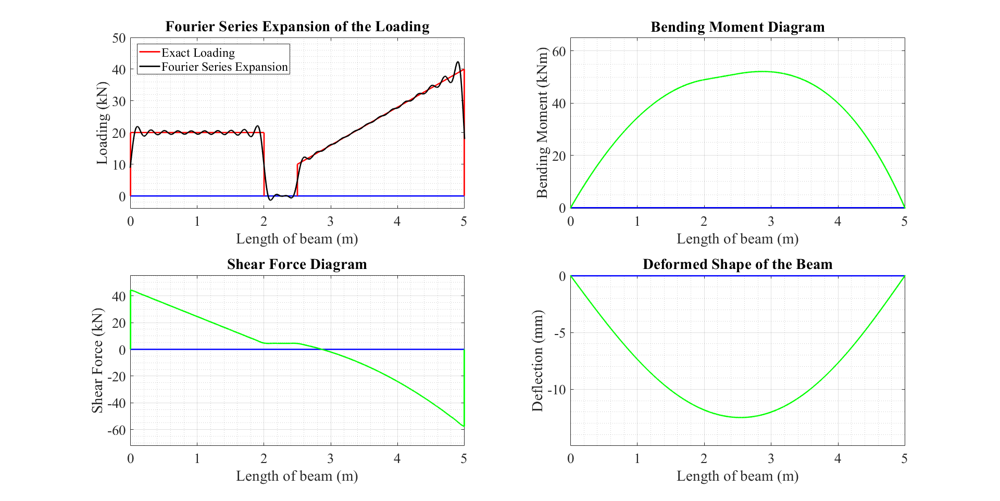

# **List of codes available in this repository:**
1. <a href="https://github.com/SubhadipN/Fourier_Series/blob/main/simply_supported_beam_gen_loading.m">*simply_supported_beam_gen_loading.m*</a>
2. <a href="https://github.com/SubhadipN/Fourier_Series/blob/main/simply_supported_plate_udp.m">*simply_supported_plate_udp.m*</a>

The purposes and the basic working principles for the MATLAB scripts are discussed in the following sections.

# Fourier Series

 According to <a href="https://en.wikipedia.org/wiki/Fourier_series#">Wikipedia</a>, a Fourier series is an expansion of a periodic function into a sum of trigonometric functions. The main advantage of expressing a function as a sum of sines and cosines is that the function becomes easier to analyze because trigonometric functions are well understood. The Fourier series is named after the French math wizard <a href="https://en.wikipedia.org/wiki/Joseph_Fourier">Jean-Baptiste Joseph Fourier</a>, who used the sum of the trigonometric series to find the solutions to the heat transfer problem (modelled as a partial differential equation). Since its first use, the Fourier series has become one of the most popular mathematical tools to be used in almost every field of engineering. Many problems of structural engineering can be solved in an easy manner by utilizing the advantage of the Fourier series. A few such applications (among many others) of the Fourier series are explained below. Working <a href="https://in.mathworks.com/?s_tid=gn_logo">MATLAB</a> codes are also provided here to apply the Fourier series directly in the case of solving the discussed problems. 

## **Analysis of a simply supported beam subjected to any arbitrary general loading:**

 Let a simply supported beam of length $L$ be subjected to any arbitrary general loading $w(x)$, as shown in Figure 1. The loading function $w(x)$ can be represented by the Fourier series of harmonic loading functions of periodicity equal to $2L$ as 
   $$w(x)=\dfrac{a_0}{2}+\sum\limits_{n=1}^{\infty} a_n\cos \dfrac{n\pi x}{L}+\sum\limits_{n=1}^{\infty} b_n\sin \dfrac{n\pi x}{L}$$ 
   where 
   $$a_0 = \dfrac{1}{L}\int\limits_0^{2L} w(x)\ dx$$ 
   $$a_n = \dfrac{1}{L}\int\limits_0^{2L} w(x) \cos \dfrac{n\pi x}{L} \ dx$$ 
   $$b_n = \dfrac{1}{L}\int\limits_0^{2L} w(x) \sin \dfrac{n\pi x}{L} \ dx$$ 
   If the response of the simply supported beam subjected to harmonic loadings, $\sin (n\pi x/L)$ and $\cos (n\pi x/L)$, and a uniformly distributed loading (UDL), $a_0/2$, are known individually, the total response of the beam due to $w(x)$ can be obtained by using the theory of superposition. However, the superposition can only be applied if the beam behaves linearly for the prescribed general loading. Now the vertical reaction forces at two supports, bending moment values, shear force values, deflection and slope profiles of the beam subjected to individual UDL and harmonic loadings are given in the following sections. 

   
  

    
  

  
 Figure 1: A simply supported beam subjected to any general loading 

### 1. Analysis of the beam when subjected to a UDL: 
   Consider a beam with a UDL of intensity $w_1(x)=a_0/2$ per unit length, as shown in Figure 2. 
  

    
  

  
 Figure 2: A simply supported beam subjected to a UDL loading 

  
   **Support reactions:** considering the moment equilibrium condition at support $B$, 
   $$R_{A1}L=\displaystyle\int_0^{L} w_1(\xi)(L-\xi)d\xi=\dfrac{a_0}{2}\displaystyle\int_0^{L} (L-\xi)d\xi=\dfrac{a_0L^2}{4} \quad\Rightarrow R_{A1}=\dfrac{a_0L}{4}\ (\uparrow)$$
   Considering the equilibrium of vertical forces,
   $$R_{A1}+R_{B1}=\dfrac{a_0L}{2}\quad \Rightarrow R_{B1}=\dfrac{a_0L}{4}\ (\uparrow)$$

   **Bending moment:** 
   $$M_{1x}=R_{A1}x-\displaystyle\int_0^{x} w_1(\xi)(x-\xi)d\xi=\dfrac{a_0Lx}{4}-\dfrac{a_0}{2}\displaystyle\int_0^{x} (x-\xi)d\xi=\dfrac{a_0Lx}{4}-\dfrac{a_0x^2}{4}\ (\mathrm{clockwise})$$

   **Shear force:**
   $$V_{1x}=\dfrac{dM_{1x}}{dx}=\dfrac{a_0L}{4}-\dfrac{a_0x}{2}\ (\uparrow)$$

   **Deflection and slope profiles:** 
 considering $EI$ as the *flexural rigidity* of the beam where $E$ is the elastic modulus of the beam material and $I$ is the second moment of area of the beam,
   $$EI\dfrac{d^2y_1}{dx^2}=M_{1x}=\dfrac{a_0Lx}{4}-\dfrac{a_0x^2}{4}$$
   $$\Rightarrow EI\dfrac{dy_1}{dx}=\dfrac{a_0Lx^2}{8}-\dfrac{a_0x^3}{12}+c_1$$
   $$\Rightarrow EIy_1=\dfrac{a_0Lx^3}{24}-\dfrac{a_0x^4}{48}+c_1x+c_2$$
   Boundary conditions for the beam can be expressed as $y_1(0)=0$ and $y_1(L)=0$, which implies that $c_1=-a_0L^3/48$ and $c_2=0$. Hence, 
   $$y_1=\dfrac{1}{EI}\left(\dfrac{a_0L^3x}{48}-\dfrac{a_0Lx^3}{24}+\dfrac{a_0x^4}{48}\right)\ (\downarrow)$$
   $$\dfrac{dy_1}{dx}=\dfrac{1}{EI}\left(\dfrac{-a_0L^3}{48}+\dfrac{a_0Lx^2}{8}-\dfrac{a_0x^3}{12}\right)\ (\mathrm{clockwise})$$ 

  
### 2. Analysis of the beam when subjected to a cosine harmonic loading:
   Consider a beam with a harmonic loading of intensity $w_2(x)=\cos\frac{n\pi x}{L}$ per unit length, as shown in Figure 3.
   
  

    
  

  
 Figure 3: A simply supported beam subjected to a cosine loading 

  
   **Support reactions:** considering the moment equilibrium condition at support $B$, 
   $$R_{A2}L=\displaystyle\int_0^{L} w_2(\xi)(L-\xi)d\xi=L\underbrace{\displaystyle\int_0^{L} \cos\dfrac{n\pi\xi}{L}\ d\xi}_{=0} -\displaystyle\int_0^{L} \xi\cos\dfrac{n\pi\xi}{L}\ d\xi =\left(\dfrac{L}{n\pi}\right)^2(1-\cos n\pi)$$
   
   $$\Rightarrow R_{A2}=\dfrac{L(1-\cos n\pi)}{(n\pi)^2}\ (\uparrow)$$
   
   Considering the equilibrium of vertical forces,
   $$R_{A2}-R_{B2}=\displaystyle\int_0^L w_2(\xi)\ d\xi= \displaystyle\int_0^L \cos\dfrac{n\pi\xi}{L}\ d\xi=0\quad \Rightarrow\ R_{B2}=\dfrac{L(1-\cos n\pi)}{(n\pi)^2}\ (\downarrow)$$

   **Bending moment:** 
   $$M_{2x}=R_{A2}x-\displaystyle\int_0^{x} w_2(\xi)(x-\xi)d\xi=\dfrac{Lx(1-\cos n\pi)}{(n\pi)^2}-x\displaystyle\int_0^x \cos\dfrac{n\pi\xi}{L}\ d\xi +\displaystyle\int_0^x \xi \cos\dfrac{n\pi\xi}{L}\ d\xi=\dfrac{L^2\left(\cos\frac{n\pi x}{L}-1\right)+Lx(1-\cos n\pi)}{(n\pi)^2}\ (\mathrm{clockwise})$$

   **Shear force:**
   $$V_{2x}=\dfrac{dM_{2x}}{dx}=\dfrac{L\left(1-\cos n\pi-n\pi\sin\frac{n\pi x}{L}\right)}{(n\pi)^2}\ (\uparrow)$$

   **Deflection and slope profiles:** 
   $$EI\dfrac{d^2y_2}{dx^2}=M_{2x}=\dfrac{L^2\left(\cos\frac{n\pi x}{L}-1\right)+Lx(1-\cos n\pi)}{(n\pi)^2}$$
   
   $$\Rightarrow EI\dfrac{dy_2}{dx}=\dfrac{L^3\sin\frac{n\pi x}{L}}{(n\pi)^3}-\dfrac{L^2x}{(n\pi)^2}+\dfrac{L(1-\cos n\pi)x^2}{2(n\pi)^2}+c_3$$
   
   $$\Rightarrow EIy_2=-\dfrac{L^4\cos\frac{n\pi x}{L}}{(n\pi)^4}-\dfrac{L^2x^2}{2(n\pi)^2}+\dfrac{L(1-\cos n\pi)x^3}{6(n\pi)^2}+c_3x+c_4$$
   
   Satisfying the corresponding boundary conditions for the beam, the constants of integration can be obtained as $c_3=\dfrac{L^3(2+\cos n\pi)}{6(n\pi)^2}-\dfrac{L^3(1-\cos n\pi)}{(n\pi)^4}$ and $c_4=\left(\dfrac{L}{n\pi}\right)^4$. Hence, 
   $$y_2=\dfrac{1}{EI}\left\lbrace\dfrac{L^4(\cos\frac{n\pi x}{L}-1)}{(n\pi)^4}+\dfrac{L^3(1-\cos n\pi)x}{(n\pi)^4}-\dfrac{L^3(2+\cos n\pi)x}{6(n\pi)^2}+\dfrac{L^2x^2}{2(n\pi)^2}-\dfrac{L(1-\cos n\pi)x^3}{6(n\pi)^2}\right\rbrace\ (\downarrow)$$
   $$\dfrac{dy_2}{dx}=\dfrac{1}{EI}\left\lbrace\dfrac{L^3(\cos n\pi-1)}{(n\pi)^4}+\dfrac{L^3\sin\frac{n\pi x}{L}}{(n\pi)^3}+\dfrac{L^3(2+\cos n\pi)}{6(n\pi)^2}-\dfrac{L^2x}{(n\pi)^2}+\dfrac{L(1-\cos n\pi)x^2}{2(n\pi)^2}\right\rbrace\ (\mathrm{clockwise})$$
  
### 3. Analysis of the beam when subjected to a sine harmonic loading:
   Consider a beam with a harmonic loading of intensity $w_3(x)=\sin\frac{n\pi x}{L}$ per unit length, as shown in Figure 4.
   
  

    
  

  
 Figure 4: A simply supported beam subjected to a sine loading 

  
   **Support reactions:** considering the moment equilibrium condition at support $B$, 
   $$R_{A3}L=\displaystyle\int_0^{L} w_3(\xi)(L-\xi)d\xi=L\displaystyle\int_0^{L} \sin\dfrac{n\pi\xi}{L}\ d\xi -\displaystyle\int_0^{L} \xi\sin\dfrac{n\pi\xi}{L}\ d\xi = \dfrac{L^2}{n\pi}\quad\Rightarrow\ R_{A3}=\dfrac{L}{n\pi}\ (\uparrow)$$

   Considering the equilibrium of vertical forces,
   $$R_{A3}+R_{B3}=\displaystyle\int_0^L w_3(\xi)\ d\xi=\displaystyle\int_0^L \sin\dfrac{n\pi\xi}{L}\ d\xi = \dfrac{L(1-\cos n\pi)}{n\pi} \quad \Rightarrow R_{B3}=-\dfrac{L\cos n\pi}{n\pi}\ (\uparrow)$$

   **Bending moment:** 
   $$M_{3x}=R_{A3}x-\displaystyle\int_0^{x} w_3(\xi)(x-\xi)d\xi=\dfrac{Lx}{n\pi}-x\displaystyle\int_0^{x} \sin\dfrac{n\pi\xi}{L}\ d\xi +\displaystyle\int_0^{x} \xi\sin\dfrac{n\pi\xi}{L}\ d\xi=\dfrac{L^2\sin\frac{n\pi x}{L}}{(n\pi)^2}\ (\mathrm{clockwise})$$

   **Shear force:**
   $$V_{3x}=\dfrac{dM_{3x}}{dx}=\dfrac{L\cos\frac{n\pi x}{L}}{n\pi}\ (\uparrow)$$

   **Deflection and slope profiles:** 
   $$EI\dfrac{d^2y_3}{dx^2}=M_{3x}=\dfrac{L^2\sin\frac{n\pi x}{L}}{(n\pi)^2}$$
   
   $$\Rightarrow EI\dfrac{dy_3}{dx}=-\dfrac{L^3\cos\frac{n\pi x}{L}}{(n\pi)^3}+c_5$$
   
   $$\Rightarrow EIy_3=-\dfrac{L^4\sin\frac{n\pi x}{L}}{(n\pi)^4}+c_5x+c_6$$
   
   Satisfying the corresponding boundary conditions for the beam, the constants of integration can be obtained as $c_5=0$ and $c_6=0$. Hence, 
   $$y_3=\dfrac{1}{EI}\cdot\dfrac{L^4\sin\frac{n\pi x}{L}}{(n\pi)^4}\ (\downarrow)$$
   $$\dfrac{dy_3}{dx}=-\dfrac{1}{EI}\cdot\dfrac{L^3\cos\frac{n\pi x}{L}}{(n\pi)^3}\ (\mathrm{clockwise})$$

### 4. Superposition of the reaction forces and the responses:

 The theory of superposition can be used to get the resultant reaction forces and responses of the simply supported beam due to any general loading $w(x)$. The behaviour of the beam must be within a linear range to make the theory of superposition to be applicable. The linear behaviour of the beam can be controlled by the $EI$ value for a particular prescribed loading $w(x)$. The expressions for the resultant reactions and other responses are given below. 

**Total reactions:**
$$\color{Greenyellow} R_A=R_{A1}+\displaystyle\sum\limits_{n=1}^{\infty}a_nR_{A2}+\sum\limits_{n=1}^{\infty}b_nR_{A3}=\dfrac{a_0L}{4}+\sum\limits_{n=1}^{\infty}\dfrac{a_nL(1-\cos n\pi)}{(n\pi)^2}+\sum\limits_{n=1}^{\infty}\dfrac{b_nL}{n\pi}\ (\uparrow)$$
$$\color{Greenyellow} R_B=R_{B1}+\displaystyle\sum\limits_{n=1}^{\infty}a_nR_{B2}+\sum\limits_{n=1}^{\infty}b_nR_{B3}=\dfrac{a_0L}{4}-\sum\limits_{n=1}^{\infty}\dfrac{a_nL(1-\cos n\pi)}{(n\pi)^2}-\sum\limits_{n=1}^{\infty}\dfrac{b_nL\cos n\pi}{n\pi}\ (\uparrow)$$

**Total bending moment:**
$$\color{Greenyellow} M_x=M_{1x}+\displaystyle\sum\limits_{n=1}^{\infty}a_nM_{2x}+\sum\limits_{n=1}^{\infty}b_nM_{3x}=\dfrac{a_0Lx}{4}-\dfrac{a_0x^2}{4}+\left(\dfrac{L}{n\pi}\right)^2\displaystyle\sum\limits_{n=1}^{\infty}\left\lbrace a_n\left(\cos\dfrac{n\pi x}{L}-1\right)+b_n \sin \dfrac{n\pi x}{L}\right\rbrace+\dfrac{Lx}{(n\pi)^2}\sum\limits_{n=1}^{\infty}a_n(1-\cos n\pi)\ (\mathrm{clockwise})$$

**Total shear force:**
$$\color{Greenyellow} V_x=V_{1x}+\displaystyle\sum\limits_{n=1}^{\infty}a_nV_{2x}+\sum\limits_{n=1}^{\infty}b_nV_{3x} = \dfrac{a_0L}{4}-\dfrac{a_0x}{2}+\dfrac{L}{(n\pi)^2}\displaystyle\sum\limits_{n=1}^{\infty}a_n(1-\cos n\pi)+\dfrac{L}{n\pi}\sum\limits_{n=1}^{\infty}\left(b_n\cos \dfrac{n\pi x}{L}-a_n\sin \dfrac{n\pi x}{L}\right)\ (\uparrow)$$

**Total deflection:**
$$\color{Greenyellow} y=y_1+\displaystyle\sum\limits_{n=1}^{\infty}a_ny_2+\sum\limits_{n=1}^{\infty}b_ny_3=\dfrac{1}{EI}\left(\dfrac{a_0L^3x}{48}-\dfrac{a_0Lx^3}{24}+\dfrac{a_0x^4}{48}\right)+\dfrac{1}{EI}\left(\dfrac{L}{n\pi}\right)^4\displaystyle\sum\limits_{n=1}^{\infty}\left\lbrace a_n\left(\cos \dfrac{n\pi x}{L}-1\right)+b_n\sin\dfrac{n\pi x}{L}\right\rbrace+\dfrac{1}{EI}\displaystyle\sum\limits_{n=1}^{\infty}a_n\left\lbrace\dfrac{L^3(1-\cos n\pi)x}{(n\pi)^4}-\dfrac{L^3(2+\cos n\pi)x}{6(n\pi)^2}+\dfrac{L^2x^2}{2(n\pi)^2}-\dfrac{L(1-\cos n\pi)x^3}{6(n\pi)^2} \right\rbrace\ (\downarrow)$$

**Total slope:**
$$\color{Greenyellow} \dfrac{dy}{dx}=\dfrac{dy_1}{dx}+\displaystyle\sum\limits_{n=1}^{\infty}a_n\dfrac{dy_2}{dx}+\sum\limits_{n=1}^{\infty}b_n\dfrac{dy_3}{dx}=\dfrac{1}{EI}\left(-\dfrac{a_0L^3}{48}+\dfrac{a_0Lx^2}{8}-\dfrac{a_0x^3}{12}\right)+\dfrac{1}{EI}\left(\dfrac{L}{n\pi}\right)^3\displaystyle\sum\limits_{n=1}^{\infty}\left( a_n\sin\dfrac{n\pi x}{L}-b_n\cos\dfrac{n\pi x}{L}\right)+\dfrac{1}{EI}\displaystyle\sum\limits_{n=1}^{\infty}a_n\left\lbrace\dfrac{L^3(\cos n\pi-1)}{(n\pi)^4}+\dfrac{L^3(2+\cos n\pi)}{6(n\pi)^2}-\dfrac{L^2x}{(n\pi)^2}+\dfrac{L(1-\cos n\pi)x^2}{2(n\pi)^2} \right\rbrace\ (\mathrm{clockwise})$$

*Example:* Consider a prismatic and simply supported beam with the prescribed loading as shown in Figure 5. 

  

    
  

  
 Figure 5: Necessary details for an example simply supported beam 

 A simple <a href="https://github.com/SubhadipN/Fourier_Series/blob/main/simply_supported_beam_gen_loading.m">MATLAB script</a> is provided in this repository to find the approximate Fourier series expansion for the given loading acting at the example beam. Also, the script can be used to generate various responses (i.e., bending moment diagram, shear force diagram and deformation profile) of the beam using the theory discussed above. The variations of the responses with respect to the length of the beam are shown in Figure 6. It is assumed that the beam behaves linearly for the prescribed loadings. The inputs of the computer script can be modified accordingly to use it for other simply supported beams due to any general loading. The accuracy of the discussed methodology greatly depends on the smoothness of the function(s) representing the external loading(s) acting on the beam. Because the Fourier series expansion of a discontinuous function will always have some error in terms of overshoot (around $9\%$ of the size of the jump) near the location of discontinuity, which is commonly known as <a href="https://en.wikipedia.org/wiki/Gibbs_phenomenon">Gibb's phenomenon</a>. Therefore, the use of the Fourier series to get the linear response of a simply supported beam with highly discontinuous external loading (e.g., point load) should be avoided. 

  

    
  

  
 Figure 6: Loading details for a simply supported beam and the corresponding responses 

  
## **Theory of plates (double series solution by Navier's method):** 

 Consider a rectangular plate of sides $a$ and $b$, simply supported on all edges and subjected to a uniform load $p(x,y)$ as shown in Figure 7. The plate has its origin in the upper left corner. 

   
  

    
  

  
 Figure 7: A simply supported plate 

 For this simply supported plate, the governing differential equation for the deflection $(w)$, based on <a href="https://en.wikipedia.org/wiki/Kirchhoff%E2%80%93Love_plate_theory">Kirchhoff's assumptions</a> (of the linear, elastic, small-deflection theory of bending for thin plates), is $$\frac{\partial^4 w}{\partial x^4}+2\ \frac{\partial^4 w}{\partial x^2 \partial y^2}+\frac{\partial^4 w}{\partial y^4} = \frac{p}{D}$$ where $D$ is the flexural rigidity of the plate and can be further expressed as $$\dfrac{Eh^3}{12(1-\nu^2)},$$ $E$ is the elastic modulus of steel, $h$ is the thickness of the plate, and $\nu$ is Poisson's ratio of steel. The above governing partial differential equation can also be expressed as $$\nabla^2\left(\nabla^2 w\right)=\nabla^4 w=\dfrac{p}{D}$$ where $$\nabla^4\left(\cdot\right)\equiv \dfrac{\partial^4}{\partial x^4}\left(\cdot\right)+2\dfrac{\partial^4}{\partial x^2 \partial y^2}\left(\cdot\right)+\dfrac{\partial^4}{\partial y^4}\left(\cdot\right)$$ is commonly known as the biharmonic operator, and $$\nabla^2\left(\cdot\right)\equiv \dfrac{\partial^2}{\partial x^2}\left(\cdot\right)+\dfrac{\partial^2}{\partial y^2}\left(\cdot\right)$$ is commonly known as the Laplace operator. Now, the solution of the governing partial differential equation, i.e., the expression of the deflected surface $w(x,y)$, along with the expression of the distributed surface loading $p(x,y)$ after considering all necessary boundary conditions, can be found in the form of an infinite double Fourier series as 
   $$w(x,y) = \sum\limits_{m=1}^{\infty} \sum\limits_{n=1}^{\infty} w_{mn}\ \sin\frac{m\pi x}{a}\ \sin\frac{n\pi y}{b}$$
   $$p(x,y) = \sum\limits_{m=1}^{\infty} \sum\limits_{n=1}^{\infty} p_{mn}\ \sin\frac{m\pi x}{a}\ \sin\frac{n\pi y}{b}$$
where
   $$p_{mn} = \dfrac{4}{ab}\int\limits_0^a \int\limits_0^b p(x,y)\ \sin\frac{m\pi x}{a}\ \sin\frac{n\pi y}{b} dxdy$$
   $$w_{mn} = \dfrac{1}{\pi^4 D} \dfrac{p_{mn}}{\left[(m/a)^2+(n/b)^2\right]^2}$$
   Therefore, the final expression for the deformation profile can be expressed as
   $$\color{Greenyellow} w(x,y) = \dfrac{1}{\pi^4 D} \sum\limits_{m=1}^{\infty} \sum\limits_{n=1}^{\infty} \dfrac{p_{mn}}{\left[(m/a)^2+(n/b)^2\right]^2}\ \sin\frac{m\pi x}{a}\ \sin\frac{n\pi y}{b}$$
   Since, $|\sin \frac{m\pi x}{a}| \leq 1$ and $|\sin \frac{n\pi y}{b}| \leq 1$ for every $x$ and $y$, the series in the the above equation is convergent. Finally, the bending moments of the plate can be expressed as
   $$\color{Greenyellow} M_x = -D\left(\dfrac{\partial^2 w}{\partial x^2}+\nu\dfrac{\partial^2 w}{\partial y^2}\right) = \dfrac{1}{\pi^2}\sum\limits_{m=1}^{\infty} \sum\limits_{n=1}^{\infty} p_{mn} \dfrac{\left[ (m/a)^2+\nu (n/b)^2 \right]}{\left[ (m/a)^2+(n/b)^2 \right]^2}\ \sin\frac{m\pi x}{a}\ \sin\frac{n\pi y}{b}$$
   $$\color{Greenyellow} M_y = -D\left(\nu\dfrac{\partial^2 w}{\partial x^2}+\dfrac{\partial^2 w}{\partial y^2}\right) = \dfrac{1}{\pi^2} \sum\limits_{m=1}^{\infty} \sum\limits_{n=1}^{\infty} p_{mn} \dfrac{\left[ \nu (m/a)^2+(n/b)^2 \right]}{\left[ (m/a)^2+(n/b)^2 \right]^2}\ \sin\frac{m\pi x}{a}\ \sin\frac{n\pi y}{b}$$

*Example:* 
 A square plate of sides $a = 2\ \mathrm{m}$ and $b = 2\ \mathrm{m}$ is simply supported on all edges and subjected to a uniform pressure $p(x,y)=p_0=1.0\ \mathrm{MPa}$. Thickness of the plate is $50\ \mathrm{mm}$ and material properties are $E=2\times 10^5\ \mathrm{MPa}$, $\nu=0.30$. A simple <a href="https://github.com/SubhadipN/Fourier_Series/blob/main/simply_supported_plate_udp.m">MATLAB script</a> is provided in this repository to determine the deflected shape (see Figure 8), and the bending moment diagrams are shown in Figure 9. 

  

    
  

  
 Figure 8: Deformed shape of the example simply supported plate subjected to the given pressure 

  

    
  

  
 Figure 9: Bending moment diagrams of the example simply supported plate subjected to the given
pressure 

